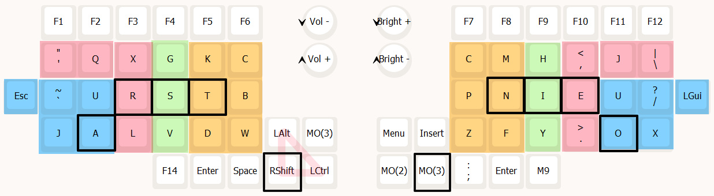
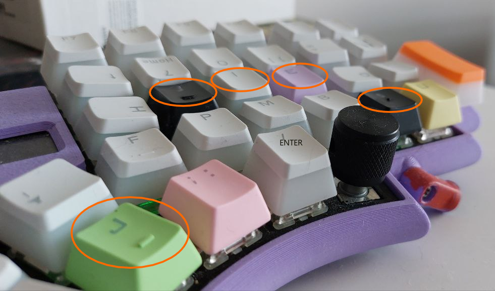
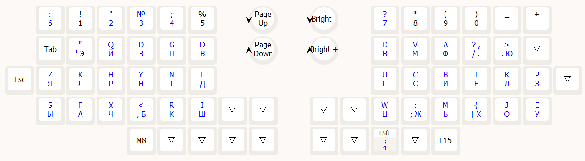
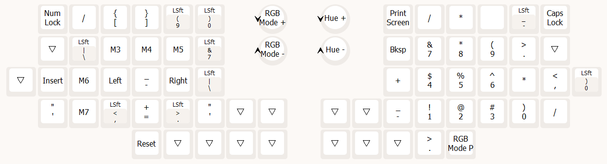
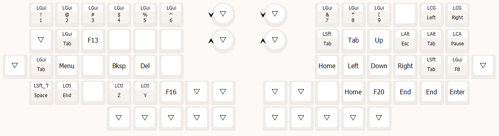

# Avalanche Layout

Avalanche layout oriented for CSharp programming, based on few well known repositories for unity plugins and some of my internal projects.

# Foreword

F-row is beyond scope of the description. when i refer to upper keys i mean topmost colored row QXGKC...

You can find Vial layout in the same folder with this readme documentation.

**Main Layout:**

## Foundation principles:

1. Adjusted to have pinky one row below on avalanche layout
2. Ring fingers are least mobile of all, so they are configured in such a way that most of the time you will press only main key. Hence swap of E and I.
3. Most comfortable places are above main keys.
4. Letters C and U are duplicated because those are the letters that appear most of the time after any letter and their duplication gives best results. Also they are symmetrical for easier learning and can be placed into less comfortable positions to ease rest of layout.
5. common hotkeys are on left side AXCV (buffer and selection operations),
6. Shift is the main key, simply because it is used more often than spaces.
   Also i wanted to have all modifiers control in one place, so you can press any combination of them with just one finger. Though Ctrl-Alt being most complicated and may not fit everyone.

## Key hints.

1. Both Enters are higher than surrounding keys, so you bump into them to be sure it is what you want.

2. Index and Thumb main keys are keys with small bumps to place your hands precisely. (F and J in std qwerty keyboard)

3. Upper keys are flipped to be as close as possible to central row.

4. Esc and Win keys are larger for easy hitting.

   Here is sample screenshot, mind that keys on the letters dont correspond to the layout, and most of the time their height and flips are intentional.

## Artifacts

1. J is duplicated, but most of the time left one is used. right one can be adjusted.
2. F14 and M9 are used to switch between Cyrillic layouts. See AHK script for that purpose.
3. MO3 on left side is used to swiftly delete or backspace with left hand.
4. K and D can be swapped, but for some reasons D combines better with other letters in down positions.

# Other Layouts

## MO-1 : Cyrilic

Based on small amount of data. untested yet.

## MO-2 : Numbers and specials.

## MO-3 : Navigation

